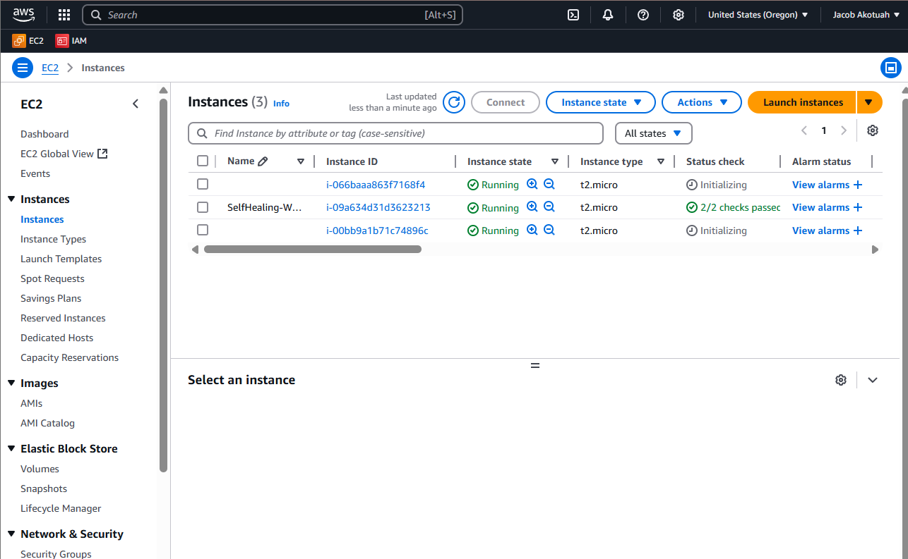
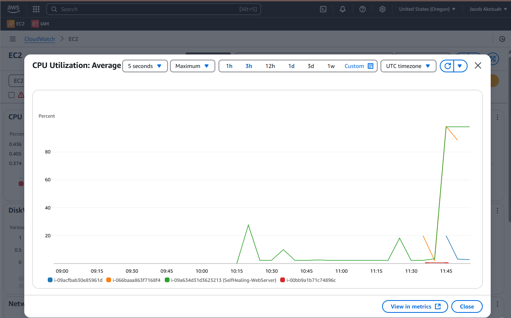

# Self-Healing Infrastructure with AWS Auto Scaling
A Complete Beginner's Guide (Zero AWS/DevOps Knowledge Required)

---

## 📌 Before You Start
✅ **You'll Need:**
*   An AWS account (Free Tier is fine)
*   A computer with internet access

⚠️ **Avoid These Common Mistakes:**
*   Skipping the key pair step (you’ll get locked out)
*   Using t2.micro for production (too small for real traffic)
*   Forgetting to open HTTP (port 80) in security groups

---

## 🚀 Step-by-Step Setup
### Step 1: Launch Your First EC2 Instance
(This will be the "golden image" for scaling)

#### A. Launch the Instance
1. Go to AWS EC2 Console
2. Click **Launch Instance** → Name it `SelfHealing-WebServer`
3. Under Application and OS Images, choose:
    *   Amazon Linux 2 AMI (Free Tier eligible)
4. Under Instance Type, select t2.micro (Free Tier)
5. Under Key Pair, click **Create new key pair**:
    *   Name: `self-healing-key` → Download `.pem` file (save it securely!)
6. Under Network Settings:
    *   Check **Allow HTTP traffic from the internet**
    *   Check **Allow SSH traffic** (only if you need terminal access)
7. Click **Launch Instance**


#### B. Install a Web Server
1. Wait 1 minute for the instance to start.
2. Copy its Public IPv4 address (e.g., 54.210.123.45)
3. Open Terminal (Mac/Linux) or PowerShell (Windows):
```bash
ssh -i "self-healing-key.pem" ec2-user@YOUR_INSTANCE_IP
```
    *   If Windows, use Git Bash or PuTTY (convert .pem to .ppk first).
4. Once logged in, run:
```bash
sudo yum update -y
sudo yum install -y httpd
sudo systemctl start httpd
sudo systemctl enable httpd
echo 'Hello from Self-Healing Demo!' | sudo tee /var/www/html/index.html
```
5. Test it: Open a browser and visit:
```
http://YOUR_INSTANCE_IP
```
    *   You should see "Hello from Self-Healing Demo!"

### Step 2: Create an AMI (Machine Image)
(This snapshot will be used to launch new instances)

1. Go back to EC2 Console → Instances
2. Right-click your instance → Image and templates → **Create Image**
3. Name it: `SelfHealing-AMI` → **Create Image**
4. Wait ~5 minutes for the AMI to be ready (check AMIs in the left menu).

### Step 3: Create a Launch Template
(A blueprint for new instances)

1. Go to EC2 → Launch Templates → **Create Launch Template**
2. Configure:
    *   Name: `SelfHealing-Template`
    *   AMI: Search for `SelfHealing-AMI` (the one you just created)
    *   Instance Type: `t2.micro`
    *   Key Pair: `self-healing-key`
    *   Security Groups: Select the one allowing HTTP (port 80)
3. Under Advanced, paste this in User Data (auto-installs Apache on launch):
```bash
#!/bin/bash
sudo yum install -y httpd
sudo systemctl start httpd
```


4. Click **Create Launch Template**

### Step 4: Set Up Auto Scaling Group (ASG)
(Handles scaling and self-healing)

#### A. Create the ASG
1. Go to EC2 → Auto Scaling Groups → **Create Auto Scaling Group**
2. Name: `SelfHealing-ASG`
3. Launch Template: Select `SelfHealing-Template`
4. VPC: Default
5. Subnets: Select at least 2 (for high availability)
6. Availability Zone Distribution: Select Balanced best effort

#### B. Configure Load Balancer
Under Load Balancing, select:
*   Attach to a new load balancer
*   Application Load Balancer
*   Name: `SelfHealing-ALB`
*   Listener: HTTP : 80
*   Target Groups: Create new (default settings)

Under Health Checks:
*   Health Check Type: ELB (replaces instances that fail LB checks)
*   Health Check Grace Period: 300 seconds (wait before checking health)
*   Leave the rest as default

#### C. Set Scaling Policies
Group Size:
*   Desired: 2 (always keep 2 instances running)
*   Minimum: 1
*   Maximum: 4

Scaling Policies:
*   Click Target Tracking → CPU Utilization → Set to 70%
*   Instance warmup: 300 seconds
*   Leave the rest as default

Click **Create Auto Scaling Group**

### Step 5: Test Self-Healing
#### A. Simulate a Crash
1. Go to EC2 → Instances → Note one of the instance IDs.

Do you notice there are new instances?


2. SSH into it (use the same ssh command from Step 1).
3. Crash Apache:
```bash
sudo systemctl stop httpd
```
4. Wait 5 minutes → The ASG will terminate the unhealthy instance and launch a new one!

#### B. Test Auto Scaling Functionality
This step demonstrates how your Auto Scaling Group (ASG) automatically reacts to increased load by launching new instances. We will simulate high CPU usage on one of your instances to trigger the scaling policy.

**Why Test Scaling?**

Testing ensures that your ASG is correctly configured to respond to changes in demand, helping maintain application performance and availability under load.

**Steps:**

1.  Connect to an EC2 Instance:
    *   Use SSH to connect to one of the EC2 instances that is part of your Auto Scaling Group. (You can find the public IP or DNS name of an instance from the EC2 console).

2.  Generate CPU Load:
    *   Once connected via SSH, run the following command:
```bash
yes > /dev/null &
```

    *   **Explanation of the command:**
        *   `yes`: This command continuously outputs the character 'y' followed by a newline.
        *   `>`: This is a redirection operator, sending the output of the `yes` command somewhere else instead of printing it to your terminal.
        *   `/dev/null`: This is a special system device that discards all data written to it. By redirecting the output of `yes` here, we prevent your terminal from being flooded with 'y' characters.
        *   `&`: This symbol runs the command in the background. This allows you to continue using your SSH session without the `yes` command blocking it.

    *   This command will consume significant CPU resources on the instance because the `yes` process is constantly running and generating output, even though that output is immediately discarded.

3.  Monitor CPU Load in CloudWatch:
    *   Open the AWS Management Console and navigate to the CloudWatch service.
    *   In the left-hand navigation pane, choose Metrics.
    *   In the metrics search bar or by browsing, find metrics for EC2.
    *   Look for the `CPU Utilization` metric for your individual instances or your Auto Scaling Group.
    *   Select the graph for the instance where you ran the `yes` command. You should observe the CPU utilization percentage increasing significantly, likely approaching 100%.

    

4.  Observe Auto Scaling Action:
    *   Go back to the Instances list in the EC2 dashboard and you will see new instances being launched and added to your ASG.

    

    

### 🧹 Step 6: Clean Up (Optional)
To avoid AWS charges:
*   Go to Auto Scaling Groups → **Delete SelfHealing-ASG**
*   Go to EC2 → **Terminate all instances**
*   Go to AMIs → **Deregister SelfHealing-AMI**
*   Delete associated Load Balancer and Target Group

### 🔧 Troubleshooting
*   **Issue:** Can’t SSH into instance - **Fix:** Check security groups (allow SSH on port 22)
*   **Issue:** Load balancer not working - **Fix:** Verify target group health checks (HTTP:80)
*   **Issue:** Instances not scaling - **Fix:** Check CloudWatch alarms for CPU metrics

### 🎉 You Did It!
Now you have:
*   ✅ Self-healing instances (auto-replace if they fail)
*   ✅ Auto-scaling (add/remove instances based on traffic)
*   ✅ Load balancing (spread traffic across instances)

## 👤 Author
Jacob Akotuah

- [📧 LinkedIn](https://www.linkedin.com/in/jacobakotuah/)
- [📝 Dev.to Blog](https://dev.to/jayk)
- [💻 GitHub](https://github.com/Jacobjayk)
